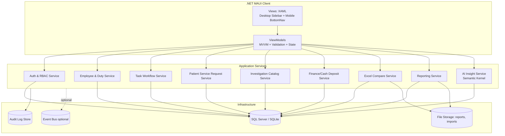
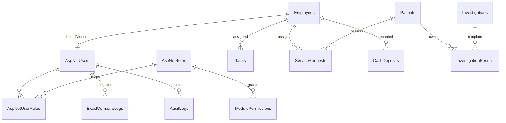

# Front Office Medical ERP — Enterprise Architecture & Implementation Blueprint

## 1) Target Technology Stack

- **Runtime:** .NET 10
- **Client:** .NET MAUI (WinUI 3 Desktop, Android, iOS)
- **Language:** C# 13+
- **Patterns:** Clean Modular Architecture + MVVM + CQRS-lite (command/query services)
- **Data Access:** Entity Framework Core
- **Database:** SQL Server (primary), SQLite (edge/offline mode)
- **Identity/Security:** ASP.NET Core Identity + JWT + refresh token + policy-based RBAC
- **AI:** Microsoft Semantic Kernel (Azure OpenAI connector)
- **Reports/Docs:** QuestPDF or iText7 + ClosedXML/EPPlus
- **Observability:** OpenTelemetry + Serilog

---

## 2) System Architecture Diagram



### Layered Responsibility (MVVM)

| Layer | Responsibility |
|---|---|
| **View** | XAML pages, controls, responsive layout, accessibility |
| **ViewModel** | Commands, validation, state transitions, navigation events |
| **Domain/Model** | Entities, value objects, enums, invariants |
| **Service/Application** | Use-cases, workflows, orchestration, policies |
| **Infrastructure/Data** | EF Core repositories, migrations, external APIs, file/report adapters |

---

## 3) Enterprise Solution Structure

```text
MedicalERP.sln
 ├─ MedicalERP.Core/               # abstractions, domain contracts, shared kernel
 ├─ MedicalERP.Models/             # domain entities, enums, value objects
 ├─ MedicalERP.Data/               # DbContext, EF configs, migrations, repositories
 ├─ MedicalERP.Services/           # application services/use cases
 ├─ MedicalERP.AI/                 # Semantic Kernel plugins, prompt pipelines
 ├─ MedicalERP.ViewModels/         # MAUI MVVM viewmodels
 ├─ MedicalERP.Views/              # XAML pages, controls, resources
 ├─ MedicalERP.Reports/            # report templates/builders/exporters
 ├─ MedicalERP.Utilities/          # excel compare, mappers, validators, helpers
 └─ MedicalERP.App/                # MAUI startup, DI, platform specific bootstrapping
```

---

## 4) Database Schema & Entity Relationships

### Core tables

1. **AspNetUsers** (Identity)
2. **AspNetRoles**
3. **AspNetUserRoles**
4. **ModulePermissions** (custom: per module operation grants)
5. **Employees**
6. **Patients**
7. **Tasks**
8. **ServiceRequests**
9. **Investigations**
10. **InvestigationResults**
11. **CashDeposits**
12. **ExcelCompareLogs**
13. **AuditLogs**
14. **RefreshTokens**

### ER diagram (logical)



### EF Core entity example

```csharp
public sealed class Employee
{
    public Guid EmployeeId { get; set; }
    public string Name { get; set; } = string.Empty;
    public string Department { get; set; } = string.Empty;
    public string Role { get; set; } = string.Empty;
    public ShiftType Shift { get; set; }
    public string ContactDetails { get; set; } = string.Empty;
    public EmployeeStatus Status { get; set; } = EmployeeStatus.Active;

    public string? IdentityUserId { get; set; }
    public ApplicationUser? IdentityUser { get; set; }

    public ICollection<TaskItem> Tasks { get; set; } = new List<TaskItem>();
}
```

### Fluent configuration example

```csharp
public sealed class EmployeeConfiguration : IEntityTypeConfiguration<Employee>
{
    public void Configure(EntityTypeBuilder<Employee> builder)
    {
        builder.ToTable("Employees");
        builder.HasKey(x => x.EmployeeId);

        builder.Property(x => x.Name).HasMaxLength(150).IsRequired();
        builder.Property(x => x.Department).HasMaxLength(100).IsRequired();
        builder.Property(x => x.ContactDetails).HasMaxLength(200);

        builder.HasIndex(x => new { x.Department, x.Status });

        builder.HasOne(x => x.IdentityUser)
            .WithOne()
            .HasForeignKey<Employee>(x => x.IdentityUserId)
            .OnDelete(DeleteBehavior.SetNull);
    }
}
```

---

## 5) Authentication, Authorization, and Security Model

### Authentication flow

1. User submits credentials.
2. ASP.NET Identity validates password hash (PBKDF2/Argon via Identity options).
3. JWT access token issued (short TTL: 10–15 min).
4. Refresh token stored with device binding + revocation support.
5. MAUI app stores tokens securely using platform secure storage.

### RBAC with granular permissions

Permission matrix key format:

- `Employees.View`
- `Employees.Create`
- `Employees.Edit`
- `Employees.Delete`
- `Employees.Export`

Use policy checks in service layer and UI visibility checks in ViewModels.

```csharp
public static class Policies
{
    public const string CanViewEmployees = "perm:Employees.View";
    public const string CanEditEmployees = "perm:Employees.Edit";
}
```

### Healthcare-grade security controls

- Encrypt PHI at rest (TDE/Always Encrypted where applicable).
- TLS 1.2+ in transit; certificate pinning for mobile.
- Audit every create/update/delete/export action.
- Data minimization in UI and reports.
- Row-level access constraints by department/site.
- Automatic session timeout + token revocation.
- MFA for privileged roles (Admin, Finance, Auditor).
- PII masking in logs and exports.
- Backup/DR policy with immutable backups.

---

## 6) Module Blueprint

### 6.1 Employee & Duty Management

**Capabilities**
- Employee profile CRUD
- Shift planning (Morning, Evening, Night)
- Conflict detection (double-booking, overtime threshold)
- Shift swap approvals and audit trail

#### Duty shift automation logic (sample)

```csharp
public async Task<IReadOnlyList<DutyAssignment>> AutoAssignShiftsAsync(
    DateOnly from,
    DateOnly to,
    CancellationToken ct)
{
    var employees = await _employeeRepo.GetActiveAsync(ct);
    var assignments = new List<DutyAssignment>();

    foreach (var day in EachDay(from, to))
    {
        foreach (var dept in employees.GroupBy(e => e.Department))
        {
            var pool = dept.OrderBy(e => e.LastAssignedOn ?? DateOnly.MinValue).ToList();

            Assign(assignments, day, ShiftType.Morning, pool, required: 2);
            Assign(assignments, day, ShiftType.Evening, pool, required: 2);
            Assign(assignments, day, ShiftType.Night,   pool, required: 1);
        }
    }

    ValidateNoConflicts(assignments);
    await _dutyRepo.UpsertRangeAsync(assignments, ct);
    return assignments;
}
```

Conflict rules:
- Max 1 shift/day/employee
- Night→Morning prohibited without rest window
- Weekly hours threshold with warning/escalation

---

### 6.2 Task & Workflow Management

Entity fields:
- TaskId, Title, Description, AssignedTo, Priority, Status, Deadline

Add:
- SLA and overdue indicators
- Notification triggers (push/local/in-app)
- Workboard filters: by department, owner, deadline

### 6.3 Patient Service Requests

Flow:
1. Request created by front office/triage.
2. Request triaged by service type.
3. Assigned to nurse/support staff.
4. Status transitions: Pending → InProgress → Completed/Cancelled.
5. Time-to-serve KPI captured.

### 6.4 Investigation Directory

- Master list of tests with pricing/version history
- Department-wise catalogs
- Search by code/name/category
- Track normal range by age/sex bands (future-ready)

### 6.5 Financial Management (Day Cash Deposit)

- Dual control submission + supervisor confirmation
- Reconciliation against billings and receipts
- Variance detection dashboard
- Exportable day-end summary

---

## 7) AI Research & Medical Insight Design (Semantic Kernel)

### AI service boundaries

- `IClinicalInsightService`
- `ITestCorrelationService`
- `IInsightAuditService`

### Prompt orchestration pattern

1. Pull patient lab trends (de-identified where possible).
2. Normalize units and ranges.
3. Run SK function for clinical summary.
4. Run correlation plugin across multi-test windows.
5. Return **assistive** insights with confidence score + disclaimer.

```csharp
public async Task<ClinicalInsight> GenerateInsightAsync(Guid patientId, CancellationToken ct)
{
    var context = await _labDataProvider.GetTrendContextAsync(patientId, ct);

    var arguments = new KernelArguments
    {
        ["lab_json"] = JsonSerializer.Serialize(context),
        ["guideline"] = "Use evidence-based language, no diagnosis claims."
    };

    var result = await _kernel.InvokePromptAsync(
        "Summarize abnormalities, probable correlations, and next test suggestions.",
        arguments,
        cancellationToken: ct);

    return ClinicalInsight.From(result.ToString());
}
```

**Safety requirements**
- AI output labeled as decision support only.
- Human clinician review gate before record finalization.
- Store prompt+response hashes for audit (not full PHI text unless policy allows).

---

## 8) Excel Data Comparison Engine Design

### Functional flow

1. Upload File A and File B (`.xlsx` / `.csv`).
2. Header mapping (auto + manual override).
3. Key column selection (single/composite).
4. Row comparison:
   - Added
   - Removed
   - Modified
5. Cell-level diff highlighting
6. Sync action with preview + conflict checks
7. Export diff report (Excel/PDF/CSV)

### Service contract

```csharp
public interface IExcelComparisonEngine
{
    Task<ComparisonReport> CompareAsync(
        Stream fileA,
        Stream fileB,
        CompareOptions options,
        CancellationToken ct);

    Task<Stream> ExportAsync(ComparisonReport report, ExportFormat format, CancellationToken ct);
}
```

### Performance considerations

- Stream processing for large files
- Batched diff operations
- Hash-based row fingerprinting
- Async background job for files above threshold (e.g., >50k rows)

---

## 9) Reporting Architecture

### Report types

- Staff utilization report
- Investigation volume and revenue report
- Daily/weekly/monthly financial summaries
- Patient service turnaround report

### Pipeline

1. Query projection DTO (read model)
2. Aggregation service
3. Renderer adapters:
   - PDF renderer
   - Excel renderer
   - CSV renderer
4. Persist artifact metadata + audit event

```csharp
public sealed class ReportOrchestrator : IReportOrchestrator
{
    public async Task<ReportFile> BuildAsync(ReportRequest request, CancellationToken ct)
    {
        var data = await _query.ExecuteAsync(request, ct);
        var file = request.Format switch
        {
            ReportFormat.Pdf => await _pdf.RenderAsync(data, ct),
            ReportFormat.Excel => await _excel.RenderAsync(data, ct),
            _ => await _csv.RenderAsync(data, ct)
        };

        await _audit.LogExportAsync(request.RequestedBy, request.Name, ct);
        return file;
    }
}
```

---

## 10) .NET MAUI UI/UX Blueprint (Material 3 / Fluent inspired)

### Navigation model

- **Desktop:** Left sidebar (modules + badges + role visibility)
- **Mobile:** Bottom tab bar + contextual top app bar
- Adaptive layout via `VisualStateManager` and idiom-specific resources

### Example shell layout

```xml
<Shell xmlns="http://schemas.microsoft.com/dotnet/2021/maui"
       xmlns:x="http://schemas.microsoft.com/winfx/2009/xaml"
       FlyoutBehavior="Locked">

    <FlyoutItem Title="Dashboard" Route="dashboard">
        <ShellContent ContentTemplate="{DataTemplate views:DashboardPage}" />
    </FlyoutItem>

    <FlyoutItem Title="Patients" IsVisible="{Binding CanViewPatients}">
        <ShellContent ContentTemplate="{DataTemplate views:PatientRequestsPage}" />
    </FlyoutItem>

    <FlyoutItem Title="Investigations" IsVisible="{Binding CanViewInvestigations}">
        <ShellContent ContentTemplate="{DataTemplate views:InvestigationsPage}" />
    </FlyoutItem>
</Shell>
```

### Example dashboard card

```xml
<Frame Padding="16" CornerRadius="14" HasShadow="True">
    <VerticalStackLayout Spacing="8">
        <Label Text="Service Requests" FontAttributes="Bold" FontSize="18"/>
        <Label Text="Pending: 24" FontSize="14"/>
        <Button Text="Open Queue" Command="{Binding OpenServiceQueueCommand}"/>
    </VerticalStackLayout>
</Frame>
```

### Theming

- DynamicResource for colors/typography
- Light/dark palettes
- 4.5:1 contrast minimum for critical text
- Touch targets >= 44x44 on mobile

---

## 11) Sample ViewModel Pattern

```csharp
public sealed partial class TasksViewModel : ObservableObject
{
    private readonly ITaskService _taskService;

    [ObservableProperty] private ObservableCollection<TaskDto> _tasks = [];
    [ObservableProperty] private bool _isBusy;

    public TasksViewModel(ITaskService taskService) => _taskService = taskService;

    [RelayCommand]
    private async Task LoadAsync()
    {
        if (IsBusy) return;
        try
        {
            IsBusy = true;
            Tasks = new ObservableCollection<TaskDto>(await _taskService.GetDashboardTasksAsync());
        }
        finally
        {
            IsBusy = false;
        }
    }
}
```

---

## 12) Deployment & Operations Blueprint

- **Environments:** Dev, QA, UAT, Prod (separate secrets & DBs)
- **CI/CD:** Azure DevOps/GitHub Actions
  - Build MAUI targets
  - Run unit/integration tests
  - Run EF migration checks
  - Sign artifacts
- **Config:** `IOptions<T>` + secure secrets provider (Key Vault)
- **Monitoring:** distributed traces, error dashboards, SLA alerts

---

## 13) Scalability & Maintainability Best Practices

1. Keep domain entities persistence-ignorant where practical.
2. Use DTO projections for read-heavy screens.
3. Introduce feature modules with clear interfaces.
4. Centralize validation (FluentValidation or custom validators).
5. Use background processing for long-running reports/comparisons.
6. Version APIs/events for forward compatibility.
7. Add audit decorators around sensitive services.
8. Add comprehensive unit tests for shift assignment, reconciliation, and diff engine.
9. Use soft delete only where compliance permits; otherwise archive strategy.
10. Add business continuity runbooks for downtime and rollback.

---

## 14) Suggested Initial Delivery Plan (Phased)

- **Phase 1:** Auth/RBAC, Employee, Duty, basic dashboard
- **Phase 2:** Tasks, Service Requests, Investigation Directory
- **Phase 3:** Finance + Reporting exports
- **Phase 4:** Excel compare engine + sync workflows
- **Phase 5:** AI insight module with clinician review gating
- **Phase 6:** Hardening (security, audit completeness, performance, DR drills)

This blueprint is implementation-ready for Visual Studio 2025/2026 and aligns with healthcare front-office operational requirements while preserving extensibility toward full hospital ERP capabilities.
