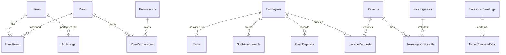

# MedicalERP Front Office Blueprint (.NET 10 + .NET MAUI)

> Enterprise architecture and implementation guide for a cross-platform front office healthcare ERP targeting **Windows (WinUI 3 Desktop)**, **Android**, and **iOS** in **Visual Studio 2025/2026**.

---

## 1) Complete System Architecture Diagram

```mermaid
flowchart TB
    subgraph Client[.NET MAUI Client Apps]
      Win[Windows WinUI 3]
      And[Android]
      iOS[iOS]
      VM[MVVM ViewModels]
      Views[XAML Views]
      Win --> Views
      And --> Views
      iOS --> Views
      Views --> VM
    end

    subgraph App[Application Services Layer]
      Auth[Auth & RBAC Service]
      Emp[Employee & Duty Service]
      Task[Task Workflow Service]
      Patient[Patient Service Request Service]
      Inv[Investigation Directory Service]
      Fin[Cash Deposit Service]
      Excel[Excel Compare Service]
      Reports[Reporting Service]
      AI[AI Insight Service (Semantic Kernel)]
    end

    subgraph Data[Data Layer]
      EF[EF Core DbContext]
      SQL[(SQL Server / SQLite)]
      Audit[(Audit Logs)]
      Blob[(File Storage: Reports/Exports)]
    end

    VM --> Auth
    VM --> Emp
    VM --> Task
    VM --> Patient
    VM --> Inv
    VM --> Fin
    VM --> Excel
    VM --> Reports
    VM --> AI

    Auth --> EF
    Emp --> EF
    Task --> EF
    Patient --> EF
    Inv --> EF
    Fin --> EF
    Excel --> EF
    Reports --> EF
    AI --> EF

    EF --> SQL
    EF --> Audit
    Reports --> Blob
```

### Logical Layers
- **View**: MAUI XAML pages and reusable controls.
- **ViewModel**: state, commands, validation, navigation.
- **Services**: orchestration, domain rules, external integrations.
- **Data**: EF Core repositories, migrations, transaction boundaries.
- **Security/Audit**: JWT, ASP.NET Identity, permission checks, immutable audit trails.

---

## 2) Database Schema and Entity Relationships

### Core ERD (high level)


### Suggested table design
- **Users** (`Id`, `UserName`, `Email`, `PasswordHash`, `IsActive`, `EmployeeId`, `CreatedUtc`)
- **Roles** (`Id`, `Name`, `Description`)
- **Permissions** (`Id`, `Module`, `Action`) where action ∈ View/Create/Edit/Delete/Export
- **RolePermissions** (`RoleId`, `PermissionId`)
- **Employees** (`EmployeeId`, `Name`, `Department`, `Role`, `Shift`, `ContactDetails`, `Status`)
- **Tasks** (`TaskId`, `Title`, `Description`, `AssignedToEmployeeId`, `Priority`, `Status`, `DeadlineUtc`)
- **Patients** (`PatientId`, `MRN`, `FullName`, `DOB`, `Gender`, `Contact`, `Status`)
- **ServiceRequests** (`RequestId`, `PatientId`, `ServiceType`, `AssignedStaffEmployeeId`, `Status`, `RequestTimeUtc`)
- **Investigations** (`InvestigationId`, `TestName`, `Department`, `Price`, `PreparationInstructions`, `NormalRange`)
- **InvestigationResults** (`ResultId`, `PatientId`, `InvestigationId`, `ResultValue`, `ResultUnit`, `ResultDateUtc`, `Flag`)
- **CashDeposits** (`DepositId`, `EmployeeId`, `Amount`, `PaymentType`, `Notes`, `DepositDateUtc`)
- **ExcelCompareLogs** (`LogId`, `UploadedByUserId`, `File1Name`, `File2Name`, `ComparedOnUtc`, `MatchColumn`)
- **ExcelCompareDiffs** (`DiffId`, `LogId`, `RecordKey`, `ColumnName`, `File1Value`, `File2Value`, `DifferenceType`)
- **AuditLogs** (`AuditId`, `UserId`, `EntityName`, `EntityId`, `Action`, `BeforeJson`, `AfterJson`, `AtUtc`)

---

## 3) .NET MAUI Modular Project Structure

```text
MedicalERP.sln
 ├─ MedicalERP.Core            # Domain contracts, constants, policies
 ├─ MedicalERP.Models          # Entities/DTOs/Enums
 ├─ MedicalERP.Data            # EF Core DbContext, migrations, repositories
 ├─ MedicalERP.Services        # Business services (Auth, Shift, Finance, Tasks)
 ├─ MedicalERP.AI              # Semantic Kernel prompts/plugins
 ├─ MedicalERP.ViewModels      # MVVM command/state orchestration
 ├─ MedicalERP.Views           # XAML pages, shell, components
 ├─ MedicalERP.Reports         # PDF/Excel/CSV generators
 └─ MedicalERP.Utilities       # Helpers, file parsing, validators
```

---

## 4) Sample C# Models and ViewModels

```csharp
public class Employee
{
    [Key] public int EmployeeId { get; set; }
    [Required, MaxLength(120)] public string Name { get; set; } = string.Empty;
    [MaxLength(80)] public string Department { get; set; } = string.Empty;
    [MaxLength(80)] public string Role { get; set; } = string.Empty;
    [MaxLength(20)] public string Shift { get; set; } = "Morning";
    [MaxLength(200)] public string ContactDetails { get; set; } = string.Empty;
    [MaxLength(20)] public string Status { get; set; } = "Active";
}

public enum PermissionAction { View, Create, Edit, Delete, Export }
```

```csharp
public partial class EmployeeViewModel : ObservableObject
{
    private readonly IEmployeeService _employeeService;

    [ObservableProperty] private ObservableCollection<Employee> employees = new();
    [ObservableProperty] private string search = string.Empty;

    public EmployeeViewModel(IEmployeeService employeeService)
        => _employeeService = employeeService;

    [RelayCommand]
    private async Task LoadAsync()
    {
        var list = await _employeeService.SearchAsync(Search);
        Employees = new ObservableCollection<Employee>(list);
    }
}
```

---

## 5) Duty Shift Automation Logic

### Rules
- Rotating sequence: `Morning -> Evening -> Night -> Off`.
- No consecutive Night shift beyond configurable threshold.
- Department-safe minimum staffing per shift.
- Conflict detection if employee already assigned same day.
- Shift change audit entry mandatory.

```csharp
public async Task AutoAssignShiftsAsync(DateOnly start, DateOnly end, string department)
{
    var staff = await _repo.GetActiveEmployeesAsync(department);

    foreach (var day in EachDay(start, end))
    {
        foreach (var employee in staff)
        {
            if (await _repo.ExistsAssignmentAsync(employee.EmployeeId, day))
                continue; // conflict-safe

            var next = await _policyEngine.GetNextShiftAsync(employee.EmployeeId, day);
            await _repo.AddShiftAsync(new ShiftAssignment
            {
                EmployeeId = employee.EmployeeId,
                ShiftDate = day,
                ShiftType = next,
                Department = department
            });

            await _audit.LogAsync("ShiftAssignment", employee.EmployeeId.ToString(), "Create");
        }
    }

    await _unitOfWork.SaveChangesAsync();
}
```

---

## 6) Excel Comparison Engine Design

### Engine flow
1. Upload two files (`.xlsx`/`.csv`).
2. Normalize headers and trim values.
3. Build key dictionary by selected match column.
4. Compare row-by-row and cell-by-cell.
5. Classify differences: `MissingInFile1`, `MissingInFile2`, `ValueMismatch`.
6. Persist `ExcelCompareLog` + diffs.
7. Export comparison report to PDF/Excel/CSV.

```csharp
public CompareResult Compare(DataTable a, DataTable b, int keyIndex)
{
    var result = new CompareResult();
    var mapA = a.Rows.Cast<DataRow>().ToDictionary(r => Normalize(r[keyIndex]));
    var mapB = b.Rows.Cast<DataRow>().ToDictionary(r => Normalize(r[keyIndex]));

    foreach (var key in mapA.Keys.Union(mapB.Keys))
    {
        if (!mapA.ContainsKey(key)) result.AddMissing("File1", key);
        else if (!mapB.ContainsKey(key)) result.AddMissing("File2", key);
        else result.AddColumnDiffs(key, mapA[key], mapB[key]);
    }

    return result;
}
```

---

## 7) AI Integration Service Design (Semantic Kernel)

### AI use cases
- Investigation result summarization.
- Multi-test correlation (e.g., glucose + lipids + LFT).
- Abnormal trend detection over time.
- Clinician-assistive (non-diagnostic) narrative suggestions.

```csharp
public class MedicalInsightService : IMedicalInsightService
{
    private readonly Kernel _kernel;

    public MedicalInsightService(Kernel kernel) => _kernel = kernel;

    public async Task<string> GenerateInsightAsync(PatientSnapshot snapshot)
    {
        var prompt = """
        You are a clinical analytics assistant.
        Analyze test values and trends. Provide risk indicators and evidence-based suggestions.
        Include disclaimer: This is assistive and not a diagnosis.
        Input: {{$input}}
        """;

        var fn = _kernel.CreateFunctionFromPrompt(prompt);
        return (await _kernel.InvokeAsync(fn, new() { ["input"] = snapshot.ToJson() })).ToString();
    }
}
```

**Governance**
- PHI minimization before prompt.
- Consent + purpose-based access.
- Prompt/output logging with redaction.
- Human-in-the-loop review before clinical usage.

---

## 8) Reporting System Architecture

### Reporting pipeline
- Query service -> reporting DTOs -> format adapters.
- Adapters: `PdfReportWriter`, `ExcelReportWriter`, `CsvReportWriter`.
- Supports filters: date range, department, employee, status.
- Supports print-ready templates and watermarking.

```csharp
public interface IReportWriter
{
    Task<ReportFile> WriteAsync<T>(IReadOnlyList<T> data, ReportOptions options, CancellationToken ct);
}
```

---

## 9) UI Layout Examples (XAML)

### Desktop shell (sidebar)
```xml
<Grid ColumnDefinitions="260,*">
  <VerticalStackLayout Grid.Column="0" BackgroundColor="#0F172A">
    <Label Text="MedicalERP" TextColor="White" FontSize="22" />
    <Button Text="Dashboard" />
    <Button Text="Patients" />
    <Button Text="Investigations" />
  </VerticalStackLayout>
  <ContentView Grid.Column="1" />
</Grid>
```

### Mobile shell (bottom tabs)
```xml
<TabBar>
  <ShellContent Title="Home" ContentTemplate="{DataTemplate views:DashboardPage}" />
  <ShellContent Title="Tasks" ContentTemplate="{DataTemplate views:TaskPage}" />
  <ShellContent Title="Requests" ContentTemplate="{DataTemplate views:ServiceRequestPage}" />
  <ShellContent Title="Reports" ContentTemplate="{DataTemplate views:ReportsPage}" />
</TabBar>
```

Implemented app footer branding style uses **"Developed by Chetan"** across pages.

---

## 10) Security Best Practices (Healthcare Grade)

- **Authentication**: ASP.NET Identity + MFA + lockout policy.
- **Authorization**: role + claim + permission matrix; deny by default.
- **Transport security**: TLS 1.3 only, cert pinning for API calls where feasible.
- **Data at rest**: SQL TDE (server) + encrypted local cache (mobile secure storage).
- **Secrets**: Azure Key Vault; never store keys in repo.
- **Auditability**: immutable audit logs for create/edit/delete/export/login events.
- **Compliance controls**: HIPAA/GDPR aligned retention, consent tracking, breach reporting workflow.
- **Operational security**: SIEM integration, anomaly alerting, regular penetration tests.
- **Backup/DR**: encrypted backups + tested recovery runbooks.
- **AI safety**: de-identification, output disclaimers, clinician validation, model/version traceability.

---

## Implementation Blueprint Summary

1. Establish modular solution and shared contracts.
2. Implement Identity + JWT and RBAC permission middleware.
3. Build Employee/Task/Service/Investigation/Finance modules with EF Core migrations.
4. Add shift automation and conflict validation.
5. Integrate Excel compare engine with export adapters.
6. Add Semantic Kernel service for insight generation.
7. Deliver reporting infrastructure with filterable exports.
8. Harden security, observability, and audit controls.
9. Finalize adaptive MAUI UI (Fluent/Material 3 patterns, light/dark).

